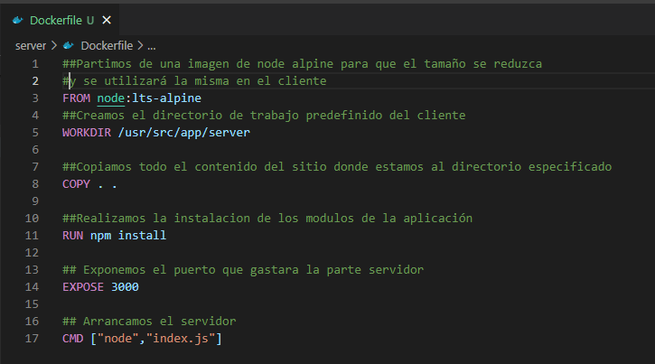

# Project With NodeJS, Angular12 and MongoDB

## Realizado por: Adrián Ramos Urenya

### Introducción

En esta práctica realizaremos el despliegue de la aplicación web realizada en la asignatura de servidor. Crearemos dos Dockerfile, uno para la parte cliente de la aplicación y el otro para la parte servidor de la aplicación. Además crearemos dos contenedores los cuales estarán comunicados mediante una network. 

La parte servidora de la aplicación web está desarrollada en un servidor express y trabajando con nodejs. Por otra parte, la parte cliente está desarrollada en Angular 12 utilizando como lenguaje Typescript. Por último, la base de datos está desarrollada con MongoDB, utilizando una estructura JSON para la manipulación de los datos

### Pasos a relizar sobre git

Para empezar la práctica, en el repositorio donde tenemos alojado el proyecto y sobre la rama main, crearemos una etiqueta de versión inicial con el contenido que tengamos subido en el repositorio.

```s
git tag V1 -m "Versión Inicial de la Aplicación"
```


Seguidamente, crearemos una rama denominada main_dockerfile para realizar los distintos pasos de la práctica

```s
git branch main_dockerfile
```


### Crear network

```s
docker network create ourbooks
```

### Pasos a realizar en el frontend

`Crear el dockerfile`

Primeramente crearemos el dockerfile donde configuraremos las opciones del dockerfile

```s
##Partimos de una imagen de node en la versión 14.17.3 
## ya que en la última versión daba error en la librería Hash
FROM node:14.17.3

##Creamos el directorio de trabajo predefinido del cliente
WORKDIR /usr/src/app/client

##Copiamos los archivos package.json y package-lock.json 
COPY package.json package-lock.json ./

##Copiamos todo el proyecto en el directorio de trabajo establecido anteriormente
## y instalamos angular en su version CLI
COPY . .
RUN npm install -y -g @angular/cli
RUN npm install
## Exponemos el puerto de trabajo de la parte cliente
## y listamos la aplicación en la dirección del Localhost que sera la que escuche la aplicación
EXPOSE 4200
CMD ng serve --host 0.0.0.0
```


`Creando la imagen`

```s
docker build -t frontend
```


`Crear la imagen`

```s
docker run -p 4200:4200 --name frontend_angCli --network ourbooks  frontend
```
### Pasos a realizar en el backend

`Base de datos`

Crearemos un dockerfile para crear una imagen de Mongo en la cual mediante mongodump y mongorestore, obtendremos los datos que tenemos en nuestra base de datos local de Mongo 

```s
FROM mongo
RUN mkdir dump
COPY /dump /dump
EXPOSE 27017
```

`Volcar los datos de nuestra base de datos`

```s
mongodump --host 127.0.0.1:27017 --db ourbooks
```

`Crear Imagen`

```s
docker build -t container_mongo .
```

`Crear Contenedor`

```s
docker run -p 27017:27017 --name mongo_database --network ourbooks  container_mongo       
```
`Ejecutar mongo `

```s
docker exec mongo_database mongorestore /dump   
```

`Crear dockerfile servidor`

```s
##Partimos de una imagen de node en su última versión
FROM node:latest
##Creamos el directorio de trabajo predefinido del cliente
WORKDIR /usr/src/app/server

##Copiamos todo el contenido del sitio donde estamos al directorio especificado
COPY . .

##Realizamos la instalacion de los modulos de la aplicación
RUN npm install 

## Exponemos el puerto que gastara la parte servidor
EXPOSE 3000

## Arrancamos el servidor
CMD ["node","index.js"]
```


`Crear la imagen`
```s
docker build -t backend .
```
`Crear el contenedor`

```s
docker run -p 3000:3000 --name backend_container --network ourbooks backend
```
### Realizar script para automatizar

Para automatizar la tarea, realizaremos un script para que automatice los procedimientos

```s
#Creamos el network
docker network create ourbooks

#CLIENT PART

#Creamos la imágen de frontend y su contenedor
cd client
docker build -t frontend .
docker run -p 4200:4200 --name frontend_angCli --network ourbooks  frontend

#MONGO DATABASE PART

#Creamos la imágen de mongo y su contenedor
cd ..
docker build -t container_mongo .
docker run -p 27017:27017 --name mongo_database --network ourbooks container_mongo

#BACKEND PART 
#Creamos la imágen de backend y su contenedor
cd server
docker build -t backend .
docker run -p 3000:3000 --name backend_container --network ourbookurbooks backend
```


### Subir las imagenes a docker hub

Para poder subir las imagenes primero nos logearemos en la plataforma y crearemos un repositorio en el cual subiremos los tags creados

`Crear Tag`

```s
docker tag backend:latest adrianramosurenya/project_angular_express:backend
```

`Crear Push`

```s
docker push adrianramosurenya/project_angular_express:backend
```

